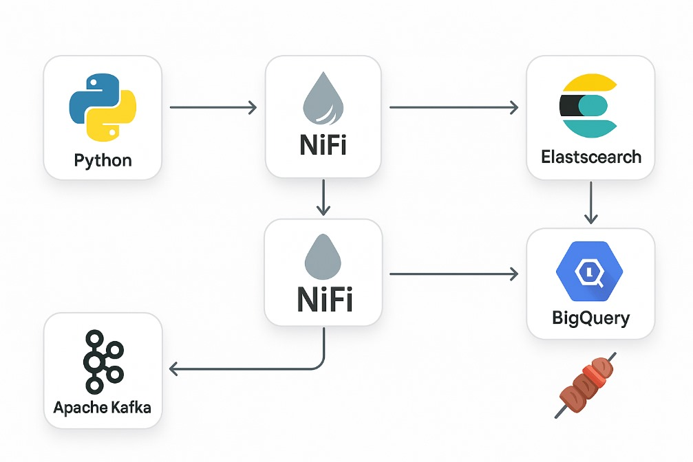

#  KEFTA GROUP – Real-Time Data Streaming Platform

> **Kefta ou Kafka ?**  
>  Ne pas confondre Kefta et Kafka...  
> L’un vous alimente en données, l’autre en protéines grillées 🍢

---

##  Objectif du projet

Créer une plateforme de **streaming Big Data** en temps réel permettant de :
- Suivre la distance entre un taxi et son client
- Estimer le prix d’un trajet en fonction du niveau de confort (low / medium / high)
- Visualiser les données en direct
- Faire de l’analyse et du Machine Learning sur BigQuery

---

##  Stack Technique

| Outil           | Rôle |
|------------------|------|
| **Python**       | Producteur de données vers Kafka |
| **Apache Kafka** | Buffer de streaming |
| **Apache NiFi**  | ETL / Transformation / Routage |
| **Elasticsearch**| Indexation pour la recherche |
| **Kibana**       | Visualisation en temps réel |
| **GCS**          | Stockage externalisé |
| **BigQuery**     | Data Warehouse + ML en SQL |

---

##  Architecture du pipeline



---

##  Structure du dépôt `kefta-group/`

Voici la structure du projet avec une description pour chaque dossier/fichier :

```bash
kefta-group/
├── kafka/                      # Scripts producteurs Python envoyant les données à Kafka
│   └── producer.py             # Script principal pour produire les données
│
├── nifi/                       # Composants liés à Apache NiFi
│   ├── kefta-template.xml      # Template XML exporté depuis NiFi
│   └── documentation.md        # Documentation du flow NiFi
│
├── gcs_bigquery/               # Scripts SQL pour Google Cloud Storage et BigQuery ML
│   ├── external_table.sql      # Création de la table externe pointant sur GCS
│   └── kmeans_model.sql        # Modèle KMeans sur BigQuery (latitude/longitude)
│
├── elasticsearch_kibana/       # Configuration Elasticsearch et dashboards Kibana
│   ├── mapping.json            # Mapping personnalisé des champs Elasticsearch
│   └── dashboard_screenshot.png # Capture du dashboard Kibana
│
├── data/                       # Données d'entrée (JSON, CSV)
│   ├── data_projet.json        # Données simulées envoyées dans Kafka
│   └── uber-split2.csv         # Fichier utilisé pour le clustering BigQuery
│
├── architecture/               # Architecture technique du projet
│   ├── kefta_architecture.png  # Schéma visuel de l’architecture du pipeline
│   └── budget_estimation.md    # Estimation du coût sur Google Cloud
│
├── .gitignore                  # Fichier pour ignorer les fichiers inutiles au versionnage
└── README.md                   # Documentation principale du projet

```
---

##  Workflow détaillé

1. **Kafka** reçoit les données depuis un script Python
2. **NiFi** transforme et envoie :
   - les données vers **Elasticsearch** pour la visualisation
   - et vers **GCS** au format Parquet
3. **BigQuery** analyse les fichiers Parquet pour :
   - Clustering en KMeans (8 clusters géographiques)
   - Calcul du chiffre d’affaires par niveau de confort

---

##  Visualisation

- Dashboard en temps réel dans **Kibana**
- Données historisées consultables via **BigQuery SQL**
- Mapping des données défini dans `mapping.json`

---

##  Machine Learning sur BigQuery

Clustering des clients/taxis basé sur leurs coordonnées 